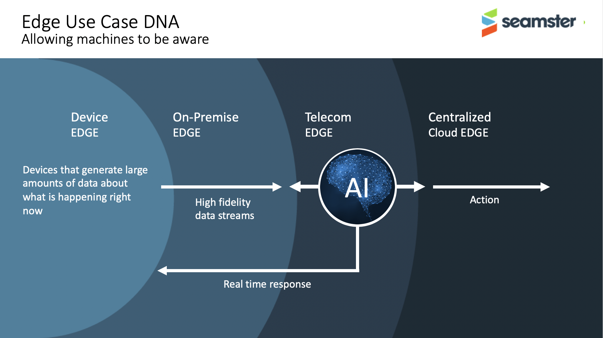
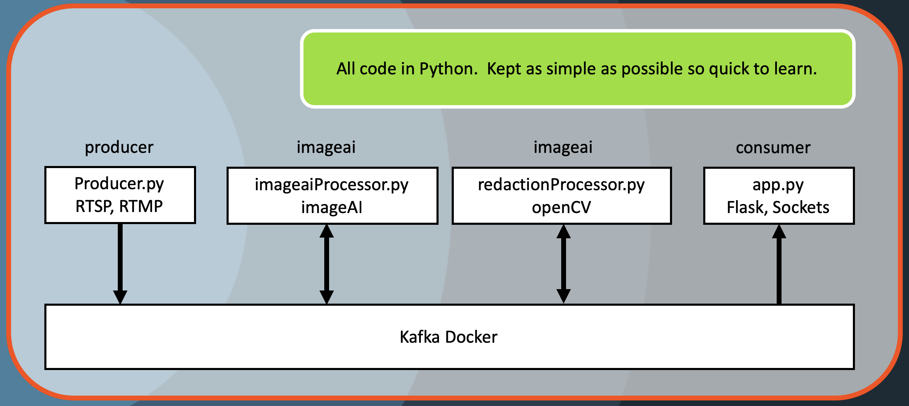
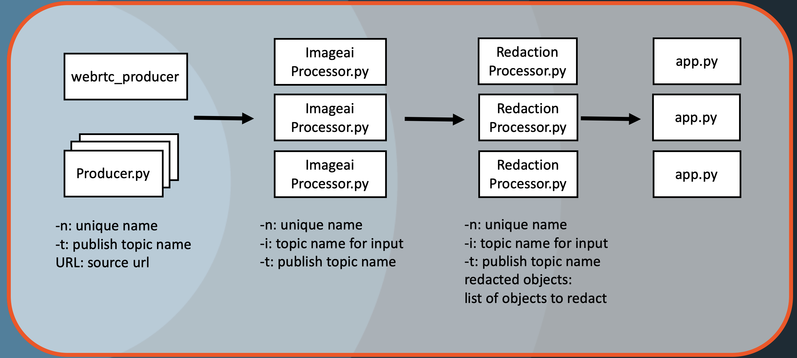

# imagebus

Microservice Message Bus Design for edge analysis of video streams

## Introduction

A distributed design pattern is required to cope with the requirements of scale video analysis. There can be many other reasons for needing to keep video analytics at the edge beyond bandwidth, including privacy, control access, device simplification, and so on. This is the first design pattern being published as a result of the [Seamster](https://seamster.io) initiative - "Our purpose is to provide a clear, comprehensive understanding of the edge market and to support industry-wide adoption of edge-enabled technologies and innovations." Seamster defines the basic DNA behind every edge use case being discovered.


This repo implements a simple example of a video processing toolchain that enables flexible deployment using a message bus for distribution. Find below the overall architecture of the solution.


All implementation is in Python 3 but due to the neutrality of Kafka, all languages can be used and can all interwork. Objects are passed using [msgpack](https://msgpack.org) formatting.

## Prerequisites

**RELEASE-NOTE-1 - This code is currently NOT compatibable with Python 3.8 due to [imageai ilbrary currently using TensorFlow 1 release](https://github.com/OlafenwaMoses/ImageAI/issues/367)**

```bash
# Python 3.7.3
$ python3 --version
Python 3.7.3

# Docker
$ docker --version
Docker version 19.03.2, build 6a30dfc

# Docker Compose
$ docker-compose --version
docker-compose version 1.24.1, build 4667896b

# java
$ java -version
openjdk version "12.0.2" 2019-07-16
OpenJDK Runtime Environment (build 12.0.2+10)
OpenJDK 64-Bit Server VM (build 12.0.2+10, mixed mode, sharing)

$ pip3 --version
pip 19.1.1

$ virtualenv --version
16.7.2

```

## Tested Environment

### Operating system

- macOS Mojave 10.14.6

**RELEASE-NOTE-2** - The author has only validated this works in a macbook environment. There may be incompatibilities with Windows and/or Linux

## Installing

To get your code up and running, first let's clone the repo locally then compose the project:

```bash
cd <PATH_OF_CHOICE>
git clone https://github.com/eusholli/imagebus
cd imagebus/
```

An overall install.sh file has been provided in the main project directory (imagebus) **OR** each process can be installed seperately.

### To Install all processes in one go

While in the main project directory (imagebus)

```bash
chmod 755 install.sh
./install.sh
```

### To Stop all processes in one go

While in the main project directory (imagebus)

```bash
chmod 755 stop.sh
./stop.sh
```

### To install each process seperately

There are 5 main processes in the repo

#### Consumer

Consumer is a python flask/socketio app, app.py, that pulls the messages from the Kafka bus and makes them available via a webserver on localhost:5000. To install execute the following

```bash
cd consumer
chmod 755 install.sh
./install.sh
cd ..
```

#### Producer

Producer is a python executable, producer.py, that grabs images from a video stream, either from a local video file if passed as an argument, or the embedded camera if no argument passed, and publishes the frame to the kafka bus. It is set to pass every 30th frame to the Kafka bus from the video feed. To install execute the following

```bash
cd producer
chmod 755 install.sh
./install.sh
cd ..
```

#### ImageAI

ImageAI contains the executables that take the source frames from the producer, analyses them for any inclusion of identifiable features and publishes the wanted result back onto the kafka message bus based on the wanted function of the processing. The object identification uses the open source [imageAI](https://imageai.readthedocs.io/en/latest/) library that can identify up to 1000 objects from 80 different types in any one frame. OpenCV is used to manipulate the images for redaction implementation. There are two examples. imageaiProcessor.py takes the original captured frame, identifies objects and creates a new image with boxes around the identified objects and also outputs the details of the indentified objects. redactionProcessor.py takes the identified objects, looks for people and publishes a new image that blacks them out. To install execute the following

```bash
cd imageai
chmod 755 install.sh
./install.sh
cd ..
```

#### kafka

Kafka runs in a docker container. No additional execution should be required.

## Running

All processes need to run in parallel and are best started in individual terminals since the consumer, producer and imageai processes run inside their own individual virtual environments. The order in which the processes are started is important. The Kafka bus must be initialised first.

### Kafka Bus

Kafka runs in its own docker container and does not need any additional config. To run, stay in the root directory of the project and execute

```bash
docker-compose up
```

### Producer Shell

```bash
cd producer
. venv/bin/activate
python producer.py WEBCAM
```

If special argument WEBCAM is passed to producer.py, the webcam of the macbook is opened as the video source. Examples of other types of video source can be rtsp streams, rtmp streams and video files stored directly on disk. For example...

```bash
 python producer.py ./friends.mp4
 python producer.py rtmp://fms.105.net/live/rmc1
 python producer.py rtsp://192.168.0.13
 $ python -h
 usage: producer [-h] [-f VALUE] [-n NAME] [-t TOPIC] URL | WEBCAM

start sampling a video source

positional arguments:
  URL | WEBCAM          the video source, either a media url(rtsp, rtmp) or
                        special string 'webcam'

optional arguments:
  -h, --help            show this help message and exit
  -f VALUE, --frame VALUE
                        process "1 every VALUEth frame fetched"
  -n NAME, --name NAME  set the name of the video source, defaults to "source"
                        if missing
  -t TOPIC, --topic TOPIC
                        set the topic name for publishing the feed, defaults
                        to SOURCE_FRAME
```

For iPhone users it is possible download the [Live Reporter app](https://apps.apple.com/us/app/live-reporter-security-camera/id996017825) for free and use the iPhone as the video streaming source. The application provides an RTSP address once running.

### Imageai Shell

```bash
cd imageai
. venv/bin/activate
$ python imageaiProcessor.py -h
usage: imageaiProcessor [-h] [-t TOPIC] [-i INPUT]

start image recognition on incoming frames

optional arguments:
  -h, --help            show this help message and exit
  -t TOPIC, --topic TOPIC
                        set the topic name for publishing the feed, defaults
                        to IMAGEAI_FRAME
  -i INPUT, --input INPUT
                        set the topic name for reading the incoming feed,
                        defaults to SOURCE_FRAME
  -n NAME, --name NAME  set the display name of this object detection process,
                        defaults to "imageaiProcessor" if missing

$ python redaction.py -h
usage: redaction [-h] [-t TOPIC] [-i INPUT]
                 [redactedObjects [redactedObjects ...]]

start redacting incoming frames

positional arguments:
  redactedObjects       list of objects to be redacted ex. person cup

optional arguments:
  -h, --help            show this help message and exit
  -t TOPIC, --topic TOPIC
                        set the topic name for publishing the feed, defaults
                        to REDACTION_FRAME
  -i INPUT, --input INPUT
                        set the topic name for reading the incoming feed,
                        defaults to IMAGEAI_FRAME
  -n NAME, --name NAME  set the display name of this redaction process,
                        defaults to "redactionProcessor" if missing
```

### Consumer Shell

```bash
cd consumer
. venv/bin/activate
python app.py
```

To view the result go to [https://localhost:5000](https://localhost:5000)

## Advanced



With no command arguments it is easy to instantiate the default image production chain.  By adding command arguments it is possible to construct very complicated image processing chains with many combinations of multiple producers, filters and outputs.  For example all video cameras in a retail store can be published under the same topic and all feeds processed in combination to find total unique visitors, versus unique visitors per camera.  

### WebRTC Producer
Also an additional producer can be found in the webrtc_producer that uses webrtc and the browser as the video source rather than an RTSP, RTMP or macbook camera as the feed.

#### Install

```bash
cd webrtc_producer
chmod 755 install.sh
./install.sh
cd ..
```

```bash
cd webrtc_producer
. venv/bin/activate
python app.py
```

To start the webrtc_producer go to [https://localhost:8080](https://localhost:8080)
